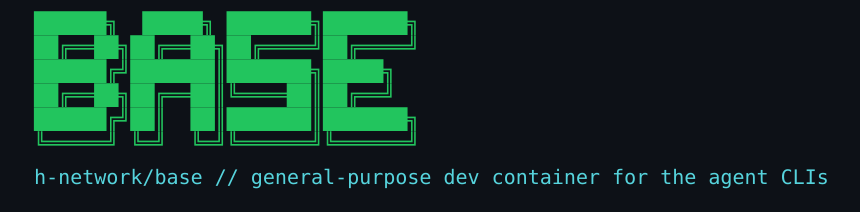

<div align="center">



<br/>

[](#-quick-start)
[](https://github.com/h-network/base/pkgs/container/base)

[](LICENSE)

[](https://github.com/h-network/base/actions/workflows/build.yml)


**A general-purpose development container: the Claude, Codex and Antigravity CLIs<br/>plus everyday dev tooling, on Ubuntu 24.04.**

Built for sandbox work — spin one up on any machine with Docker and get the same environment every time, without reinstalling toolchains by hand.

[Quick start](#-quick-start) · [What's inside](#-whats-inside) · [Helpers](#-helpers) · [Details](#-details-worth-knowing) · [Layout](#-layout)

</div>

---

## 🚀 Quick start

Two ways to get it. Both give the same image.

<table>
<tr>
<th align="left">Pull the published image</th>
<th align="left">Build it yourself</th>
</tr>
<tr valign="top">
<td>

```bash
docker run -it --rm \
  ghcr.io/h-network/base:latest
```

No clone, no build.

</td>
<td>

```bash
git clone https://github.com/h-network/base.git
cd base
docker compose build
docker compose run --rm dev
```

</td>
</tr>
</table>

Published for `linux/amd64` and `linux/arm64`, so Docker pulls whichever matches
the machine. `:latest` tracks `main`; version tags (`:1`, `:1.2`, `:1.2.3`) are
published from git tags and are what you want to depend on — they do not move.

Building always fetches the current release of each agent CLI, so a rebuild is
how you refresh them. A published tag is frozen at whenever it was built.

## 📦 What's inside

| | |
|---|---|
| **Agent CLIs** | `claude`, `codex`, `agy` |
| **Helpers** | `startAgent`, `setupConfigDir`, `probeProvider`, `smokeTest` |
| **Dev** | `git`, `gh`, `python3`, `python3-venv`, `python3-pip`, `build-essential` |
| **Shell** | `tmux` (configured), `vim-tiny`, `openssh-client`, `sudo` |
| **Base** | `ubuntu:24.04`, UTF-8 locale |

Roughly 450 MB.

## 🧰 Helpers

### `startAgent` — launch a CLI with the container's defaults

```bash
startAgent           # $AGENT_CLI, default claude
startAgent codex
startAgent claude --resume     # extra arguments pass through
```

Each CLI spells "don't stop to ask me" differently — `--dangerously-skip-permissions`
for claude and agy, `--dangerously-bypass-approvals-and-sandbox` for codex.
`startAgent` knows which is which so you don't have to.

> [!WARNING]
> **Approval prompts are skipped by default**, because the flags above are meant
> for exactly this situation: a disposable container running as an unprivileged
> user. That assumption breaks the moment you bind-mount a host directory you
> care about — set `AGENT_SKIP_PERMISSIONS=0` to keep the prompts.

| variable | |
|---|---|
| `AGENT_CLI` | default CLI when none is named (default `claude`) |
| `AGENT_SKIP_PERMISSIONS` | `1` (default) skips approval prompts, `0` keeps them |
| `AGENT_CLAUDE_TOOLS` | claude's tool list (default `Bash Read Write Edit Glob Grep`; empty = unrestricted) |

Only claude can restrict its tool set from the command line — agy and codex have
no equivalent, so they run with their full set.

#### Pointing claude at a local inference endpoint

Supported for **`claude` only**. Describe the intent and `startAgent` translates
it into the several `ANTHROPIC_*` variables claude actually reads:

```bash
AGENT_PROVIDER_URL=http://10.0.0.5:8000 \
AGENT_PROVIDER_MODEL=some-model-id \
startAgent claude
```

| variable | |
|---|---|
| `AGENT_PROVIDER_URL` | endpoint base; a trailing `/v1` is stripped here, because claude appends `/v1/messages` itself |
| `AGENT_PROVIDER_MODEL` | model id, byte for byte as the endpoint serves it |
| `AGENT_PROVIDER_SMALL_MODEL` | optional, defaults to `AGENT_PROVIDER_MODEL` |
| `AGENT_PROVIDER_TOKEN` | optional; a placeholder is sent, since claude will not start without one |

All three model tiers are set from these, because claude picks a tier
internally — setting only some leaves the rest pointing at vendor model names
the endpoint does not serve, which claude reports as a *model* error. Any
inherited `ANTHROPIC_*` variables are cleared first, so a leftover key from a
previous subscription cannot quietly win.

> [!WARNING]
> **`codex` and `agy` refuse to start when `AGENT_PROVIDER_URL` is set**, and
> exit non-zero. Neither can be pointed at a local endpoint, and starting them
> anyway would run the agent against the vendor — different cost, different
> destination for your code, and nothing on screen to say so. Setting that
> variable states an intent, and failing it is an error rather than a fallback.

### `setupConfigDir` — a second config dir, seeded from your profile

```bash
setupConfigDir work          # → ~/.claude-work + ~/.codex-work
setupConfigDir work --same   # ...and copy the existing logins across
setupConfigDir               # show what this shell is using
setupConfigDir default       # back to ~/.claude and ~/.codex
```

Exporting `CLAUDE_CONFIG_DIR` by hand points the CLI at an **empty** directory,
so it quietly runs on stock defaults instead of the profile you set up.
`setupConfigDir` copies your profile in first — `settings.json`, `config.toml`,
and any `skills/`, `agents/` or `CLAUDE.md` beside them. Session history and
logins are left behind, which is what makes the new dir separate; `--same`
copies the logins too.

It sets `CLAUDE_CONFIG_DIR` and `CODEX_HOME` together, and applies to the
calling shell only — a new shell is back on the defaults.

### `probeProvider` — see what a local endpoint serves, and whether claude can use it

```bash
probeProvider http://10.0.0.5:8000              # list, then verify with the first id
probeProvider http://10.0.0.5:8000 some-model   # verify with a specific one
```

Lists model ids from `/v1/models` (vLLM and anything else OpenAI-shaped),
falling back to `/api/tags` for ollama, then POSTs to `/v1/messages` to check
claude can actually talk to it — serving models and implementing the route
claude uses are not the same thing.

The ids are printed rather than described because they have to match exactly;
an ollama tag like `gpt-oss:20b` mistyped as `gpt-oss-20b` comes back later as
a model error rather than as a typo.

It waits up to 90 seconds (`PROBE_TIMEOUT`) and reports "no answer" separately
from "not usable": a model loading cold can take tens of seconds, and treating
that as a verdict on the endpoint sends you to debug the wrong thing.

### `smokeTest` — check the entry points still exist

```bash
smokeTest        # exits 0, or lists what is broken and exits 1
```

Runs during the build and fails it, so an image that publishes has at least
been shown to have a working `startAgent`, all three CLIs on `PATH`, and config
files that parse. Re-runnable inside a container that is already up.

It proves only that those things exist and start — no model, no credentials, no
network — and it says so in its own output, because a green build here is easy
to read as more assurance than it is.

## 🔍 Details worth knowing

<details open>
<summary><b>Runs as <code>ubuntu</code> (uid 1000), not root</b></summary>

The agent CLIs misbehave under root — Claude Code refuses
`--dangerously-skip-permissions` there. `sudo` is available without a password.

</details>

<details open>
<summary><b>Nothing is bind-mounted by default</b></summary>

`compose.yaml` uses named volumes, so agent logins and `/workspace` survive
`--rm` without inheriting host file ownership. Work is expected to live in git,
cloned inside the container.

If you do bind-mount a host directory, note that the image is uid 1000 — on a
host where you are not uid 1000, writes will fail. Either `chown -R 1000:1000`
the directory or run with `--user $(id -u):$(id -g)`.

</details>

<details open>
<summary><b>Python packages need a venv</b></summary>

Ubuntu 24.04 is PEP 668 managed, so system-wide `pip install` is refused by
design:

```bash
python3 -m venv .venv && .venv/bin/pip install <package>
```

</details>

<details open>
<summary><b>The first-run dialogs are already answered</b></summary>

Each CLI opens on a dialog the first time it runs and waits for a keypress.
With nobody at the terminal that is indistinguishable from an idle agent — no
error, no exit code, no log line — so the image answers them in advance:

| dialog | key | file |
|---|---|---|
| theme picker | `hasCompletedOnboarding` | `~/.claude.json` |
| bypass-permissions acceptance | `skipDangerousModePermissionPrompt` | `~/.claude/settings.json` |
| "Update available!" | `check_for_update_on_startup` | `~/.codex/config.toml` |
| "Do you trust this folder?" for `/workspace` | `hasTrustDialogAccepted` | `~/.claude.json` |

`~/.claude/settings.json` also turns off telemetry and error reporting, blanks
the `attribution` fields so nothing is added to commit messages or PR bodies,
and denies `mcp__*` so a cloned repository cannot introduce tool surface you
did not approve. `~/.codex/config.toml` keeps `approval_policy` and
`sandbox_mode` set even though `startAgent` passes equivalents — a `codex` run
directly, without the wrapper, would otherwise stall.

None of this is a login; the CLIs still ask you to authenticate.

> [!NOTE]
> A consumer that ships its own `settings.json` **replaces** this file rather
> than merging with it, and so stops inheriting anything added here later —
> including suppression for a dialog that does not exist yet. That is the
> intended escape hatch, but it is worth choosing deliberately.

The trust prompt is keyed by absolute path, so only `/workspace` — the image's
`WORKDIR`, and where an agent starts unless told otherwise — is answered ahead
of time. Working anywhere else prompts once on first use.

</details>

<details open>
<summary><b>No credentials are baked into the image</b></summary>

Authenticate inside the container (`claude`, `codex`, `gh auth login`); the
compose volumes persist it.

</details>

## 📁 Layout

```
Dockerfile                  the image
LICENSE                     Apache 2.0
NOTICE                      what the licence covers, and what it does not
compose.yaml                build + run, named volumes
tmux.conf                   copied to ~/.tmux.conf
claude-settings.json        → ~/.claude/settings.json
codex-config.toml           → ~/.codex/config.toml
startAgent.sh               → /usr/local/bin/startAgent
setupconfigdir.sh           → /etc/profile.d/ (a shell function, so it can export)
smoketest.sh                → /usr/local/bin/smokeTest, and run during the build
probeprovider.sh            → /usr/local/bin/probeProvider
.github/workflows/build.yml builds and publishes to GHCR
docs/assets/banner.svg      the banner above
docs/assets/badges/         the badges above — self-hosted, not shields.io, so
                            the README fetches nothing outside github.com
docs/assets/mkbadges.py     regenerates docs/assets/badges/
```

## 🚢 Cutting a release

Push a version tag; the workflow builds both architectures and publishes them.

```bash
git tag v1.2.3 && git push origin v1.2.3
```

`main` publishes `:main` and `:latest` on every push. There are no tarball
releases — the image is pulled from GHCR.

## 📄 License

[Apache License 2.0](LICENSE). Every file in this repository carries an
`SPDX-License-Identifier: Apache-2.0` header, and the image declares
`org.opencontainers.image.licenses=Apache-2.0`.

That covers this repository's own files — the Dockerfile, scripts and config.
It does **not** cover what the build installs into the image: Ubuntu's packages,
`gh`, and the three agent CLIs all keep their own terms. [`NOTICE`](NOTICE) has
the details, and both files ship inside the image at
`/usr/share/doc/h-network-base/`.

> [!NOTE]
> The agent CLIs are not open-source components. Publishing an image built from
> this repository redistributes them, which the Apache grant here says nothing
> about — check each vendor's terms first.
